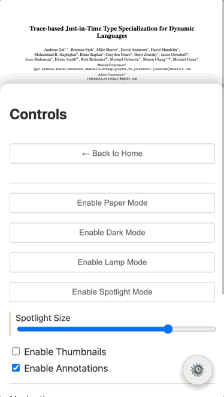

# Spotlight PDF Viewer



This is a web reader application. It has a level of abstraction of PDF.js in the core packages. It includes both the logical part of the navigation and also some particular themes I made to make the experience of reading on a display really pleasant.

The demo above corresponds to the code in the `playground` directory, and the service itself can be visited at the GitHub Pages of the code repo:
[https://reneang17.github.io/spotlight/](https://reneang17.github.io/spotlight/)

## Features

- **High Performance**: Uses `IntersectionObserver` to render only what is visible.
- **Definition Control**: Adjust rendering quality (pixel density) dynamically to balance performance and sharpness.
- **Headless Controller**: The core logic is decoupled from the UI, allowing you to build your own interface or use the provided "Playground" implementation.
- **Thumbnails**: Built-in support for generating and navigating page thumbnails.
- **Local File Support**: Load PDFs directly from the browser without server uploads.

## How to Use

To use Spotlight in your own project, you can import the `BridgePDF` class and initialize it with a container element.

### 1. Installation

(Coming soon to npm)
For now, you can copy the `packages/core` directory into your project, or use it via standard workspace imports (`@bridge-pdf/core`) if using a monorepo setup.

### 2. Basic Setup

```javascript
import { BridgePDF } from '@bridge-pdf/core';
import '@bridge-pdf/core/src/theme.css'; // Optional: if using themes

// 1. Select the container where the PDF will be rendered
const container = document.getElementById('pdf-container');

// 2. Initialize the viewer
const viewer = new BridgePDF(container, {
  url: 'path/to/document.pdf', // Initial document URL (optional)
  workerUrl: '/pdf.worker.min.mjs', // Path to PDF.js worker
  scale: 1.0, // Initial zoom level
  quality: 1.0  // Initial rendering quality (1.0 = standard, 2.0 = high def)
});

// 3. Load a document (if not provided in options)
viewer.loadDocument('https://example.com/my-document.pdf');
```

## Controller Settings

When initializing `BridgePDF`, you can pass an options object to configure the viewer:

| Option | Type | Default | Description |
| :--- | :--- | :--- | :--- |
| `url` | `string` | `''` | URL of the PDF to load initially. |
| `workerUrl` | `string` | `null` | Path to the `pdf.worker.min.mjs` file. Essential for performance. |
| `scale` | `number` | `1.0` | Initial zoom level of the document (1.0 = 100%). |
| `quality` | `number` | `1.0` | **Definition Control**. Multiplier for canvas pixel density. Use `2.0` or higher for "Retina" crispness, or `0.5` for lower memory usage. |
| `scrollMode` | `number` | `0` | `0`: Vertical, `1`: Horizontal, `2`: Wrapped. |
| `enableAnnotationLayer` | `boolean` | `true` | Whether to render links and form fields. |

## API Methods

Once initialized, you can control the viewer programmatically:

- `viewer.loadDocument(url)`: Load a new PDF.
- `viewer.goToPage(pageNumber)`: Scroll to a specific page.
- `viewer.setZoom(scale)`: Set the zoom level.
- `viewer.setRenderQuality(quality)`: Update the definition/quality dynamically.
- `viewer.nextMatch() / prevMatch()`: Navigate search results (if search is implemented).

## Reading Modes

We provide a `ThemeController` class to manage reading modes. This controller applies CSS classes to a container (usually `document.body`) to enable different visual themes:

-   **Paper Mode** (`theme-paper`): A warm, textured background to reduce eye strain.
-   **Dark Mode** (`theme-dark`): Inverted colors for low-light environments.
-   **Lamp Mode** (`theme-lamp`): Dims content and adds a warm overlay.
-   **Spotlight Mode** (`theme-spotlight`): Focuses attention on a specific area.

To use:

```javascript
import { ThemeController } from '@bridge-pdf/core';
import '@bridge-pdf/core/src/theme.css'; // Import theme styles

const themeController = new ThemeController(document.body);

// Toggle modes
themeController.togglePaperMode();
themeController.toggleDarkMode();
// etc.
```

## Running the Demo

We have two demos available in the playground:

1.  **Main Demo**: A full-featured viewer with all controls.
    -   URL: `http://localhost:5173/` (after running `npm run dev`)
2.  **Reading Modes Demo**: A dedicated page to showcase the different reading themes.
    -   URL: `http://localhost:5173/modes.html`

To run them:

1.  Clone the repository:
    ```bash
    git clone https://github.com/reneang17/spotlight.git
    cd spotlight
    ```

2.  Install dependencies:
    ```bash
    npm install
    ```

3.  Start the development server:
    ```bash
    npm run dev
    ```

## License

MIT
