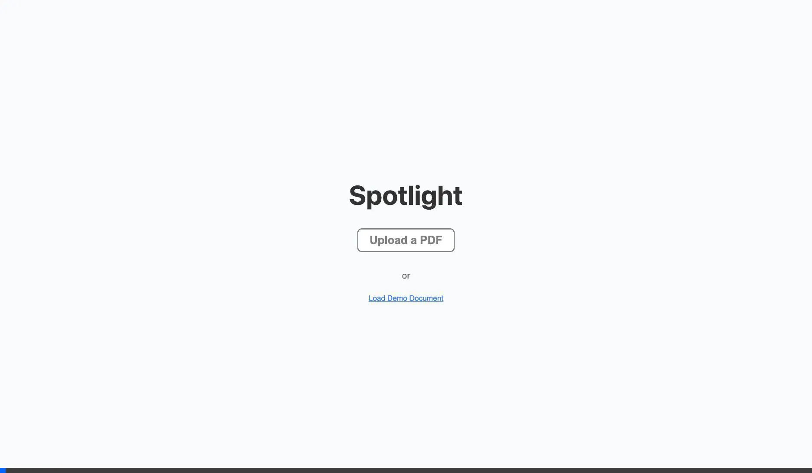

# Spotlight PDF Viewer



**Spotlight** is a lightweight, high-performance PDF viewer for the web. Built on top of `pdf.js`, it provides a headless controller (`BridgePDF`) separate from the visualization layer, giving you full control over the styling and behavior of your PDF viewer.

It features virtualized rendering for large documents, a customizable definition/quality slider, and a clean, modern UI.

## Features

- **High Performance**: Uses `IntersectionObserver` to render only what is visible.
- **Definition Control**: Adjust rendering quality (pixel density) dynamically to balance performance and sharpness.
- **Headless Controller**: The core logic is decoupled from the UI, allowing you to build your own interface or use the provided "Playground" implementation.
- **Thumbnails**: Built-in support for generating and navigating page thumbnails.
- **Local File Support**: Load PDFs directly from the browser without server uploads.

## How to Use

To use Spotlight in your own project, you can import the `BridgePDF` class and initialize it with a container element.

### 1. Installation

(Coming soon to npm)
For now, you can copy the `packages/core` directory into your project.

### 2. Basic Setup

```javascript
import { BridgePDF } from './path/to/core/BridgePDF.js';

// 1. Select the container where the PDF will be rendered
const container = document.getElementById('pdf-container');

// 2. Initialize the viewer
const viewer = new BridgePDF(container, {
  url: 'path/to/document.pdf', // Initial document URL (optional)
  workerUrl: '/pdf.worker.min.mjs', // Path to PDF.js worker
  scale: 1.0, // Initial zoom level
  quality: 1.0  // Initial rendering quality (1.0 = standard, 2.0 = high def)
});

// 3. Load a document (if not provided in options)
viewer.loadDocument('https://example.com/my-document.pdf');
```

## Controller Settings

When initializing `BridgePDF`, you can pass an options object to configure the viewer:

| Option | Type | Default | Description |
| :--- | :--- | :--- | :--- |
| `url` | `string` | `''` | URL of the PDF to load initially. |
| `workerUrl` | `string` | `null` | Path to the `pdf.worker.min.mjs` file. Essential for performance. |
| `scale` | `number` | `1.0` | Initial zoom level of the document (1.0 = 100%). |
| `quality` | `number` | `1.0` | **Definition Control**. Multiplier for canvas pixel density. Use `2.0` or higher for "Retina" crispness, or `0.5` for lower memory usage. |
| `scrollMode` | `number` | `0` | `0`: Vertical, `1`: Horizontal, `2`: Wrapped. |
| `enableAnnotationLayer` | `boolean` | `true` | Whether to render links and form fields. |

## API Methods

Once initialized, you can control the viewer programmatically:

- `viewer.loadDocument(url)`: Load a new PDF.
- `viewer.goToPage(pageNumber)`: Scroll to a specific page.
- `viewer.setZoom(scale)`: Set the zoom level.
- `viewer.setRenderQuality(quality)`: Update the definition/quality dynamically.
- `viewer.nextMatch() / prevMatch()`: Navigate search results (if search is implemented).

## Running the Demo

1.  Clone the repository:
    ```bash
    git clone https://github.com/reneang17/spotlight.git
    cd spotlight
    ```

2.  Install dependencies:
    ```bash
    npm install
    ```

3.  Start the development server:
    ```bash
    npm run dev
    ```

## License

MIT
